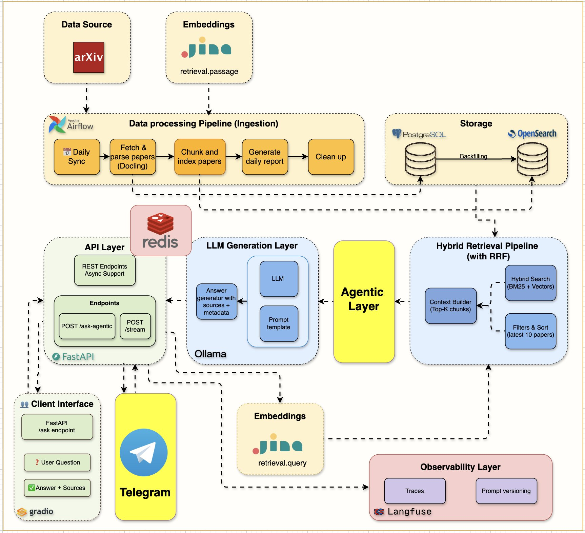

# RAG Pipeline Builder Skill for Manus AI

This repository contains a "Skill" for the Manus AI agent, designed to build a production-ready RAG (Retrieval-Augmented Generation) pipeline from scratch. It provides a structured, step-by-step workflow that guides the agent through the entire process, from data ingestion to API deployment.

## Core Architecture

This skill is based on the following RAG architecture, which combines robust open-source tools to create a powerful and observable question-answering system.



## What is a Manus Skill?

A Manus Skill is a modular package that extends the agent's capabilities with specialized, procedural knowledge. It acts as an "onboarding guide" for a specific task, transforming the general-purpose agent into a specialist. This skill, for example, makes Manus an expert in building RAG systems.

## How This Skill Works

The skill breaks down the complex process of building a RAG pipeline into five manageable, sequential steps. The agent follows these steps in order, using the detailed instructions and code examples provided in the `references/` directory.

| Step | Directory | Description |
| :--- | :--- | :--- |
| **1. Ingestion** | `references/01_ingestion.md` | Load raw documents (PDFs, etc.), split them into text chunks, and generate vector embeddings using models like Jina AI. |
| **2. Storage** | `references/02_storage.md` | Set up a vector database (like OpenSearch) and store the processed text chunks and their embeddings for efficient retrieval. |
| **3. Retrieval** | `references/03_retrieval.md` | Implement a hybrid search strategy (combining keyword-based BM25 and semantic vector search) to find the most relevant documents for a given query. |
| **4. Generation** | `references/04_generation.md` | Use a Large Language Model (LLM), served locally via Ollama, to generate a coherent answer based on the retrieved context. |
| **5. API & Observability** | `references/05_api_and_observability.md` | Expose the entire pipeline as a FastAPI web endpoint and integrate observability tools like LangFuse to monitor and debug the system. |

## How to Use

This repository is structured to be used directly by the Manus AI agent.

1.  **Import the Skill**: In the Manus environment, you can load this skill to give the agent the knowledge contained within.
2.  **Give a High-Level Prompt**: Ask the agent to perform a task like: `"Build a RAG system for my internal documentation based on this architecture."`
3.  **Agent Execution**: The agent will automatically detect and use this skill. It will read the main `SKILL.md` file to understand the workflow and then proceed step-by-step, consulting the `references/` files for detailed instructions at each stage.

### Directory Structure

```
. (root)
├── SKILL.md                          # Main entry point for the Manus agent, outlining the core workflow.
├── README.md                         # This file, providing a human-readable overview.
├── assets/
│   └── architecture.jpg              # The architecture diagram.
└── references/
    ├── 01_ingestion.md               # Detailed guide for Step 1
    ├── 02_storage.md                 # Detailed guide for Step 2
    ├── 03_retrieval.md               # Detailed guide for Step 3
    ├── 04_generation.md              # Detailed guide for Step 4
    └── 05_api_and_observability.md   # Detailed guide for Step 5
```

## Prerequisites

To run the code examples provided in this skill, you will need Python and the following libraries:

```bash
# Core dependencies
pip install llama-index fastapi uvicorn python-dotenv

# Dependencies for specific components shown in the architecture
pip install llama-index-vector-stores-opensearch llama-index-llms-ollama llama-index-embeddings-jinaai langfuse llama-index-callbacks-langfuse
```

## License

This project is licensed under the MIT License. See the [LICENSE](LICENSE) file for details.
